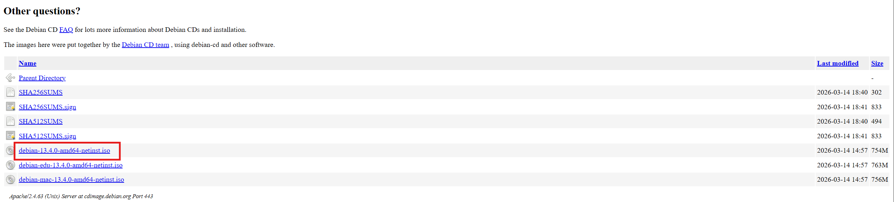
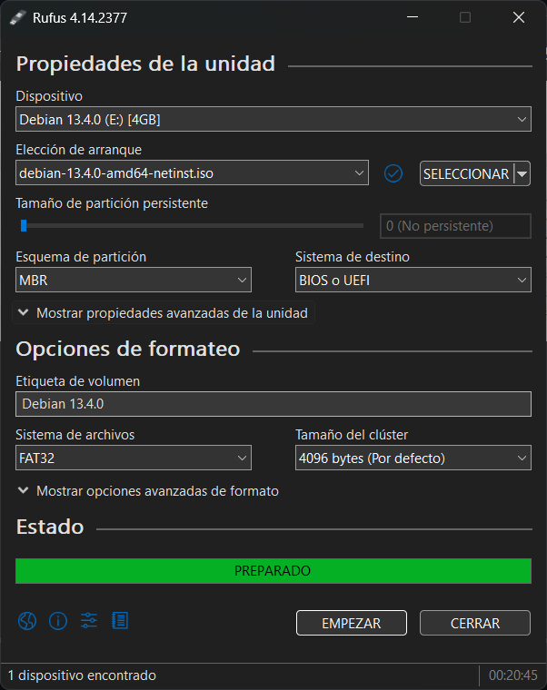
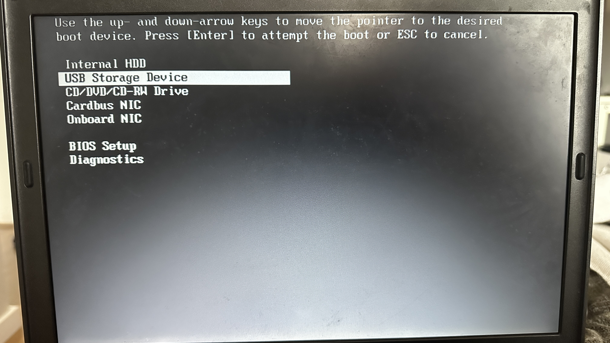
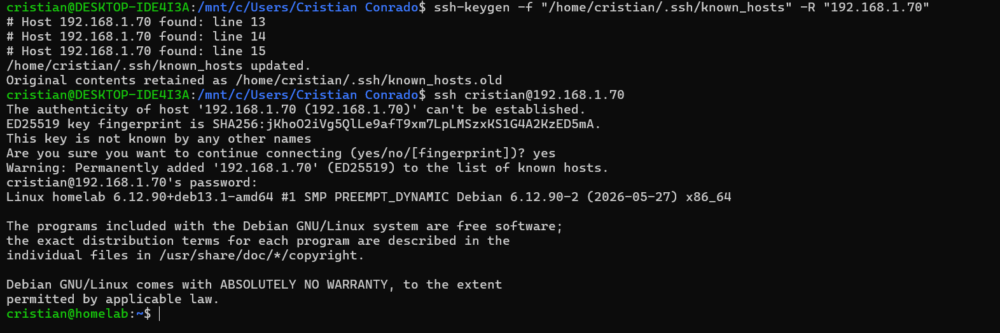

# Debian 12 Installation Guide — Dell Latitude D630

## Before you start

- USB stick (min 1GB) flashed with `debian-x.x.x-amd64-netinst.iso` via Rufus (MBR)
- Ethernet cable connected to the D630
- Router with DHCP enabled (standard home setup)

---

## 0. Flashing the USB with Rufus

Download the `netinst` ISO from `https://cdimage.debian.org/debian-cd/current/amd64/iso-cd/` and open Rufus with the following settings:



- Device → your USB stick
- Boot selection → the downloaded ISO
- Partition scheme → **MBR**
- File system → FAT32
- Everything else → default


> It is in spanish but the configuration is the same.

Click START and wait for it to finish.
> ⚠️ YOU WILL KNOW WHEN IT IS DONE BECAUSE THE BAR IS FULL, no need to click START again

---

## 1. Boot from USB

1. Power on the D630
2. Press **F12** repeatedly during boot → boot menu appears
3. Select your USB drive



4. In the Debian menu select **Install** (not Graphical Install — same thing, no mouse)

---

## 2. Initial setup

| Screen | Choose |
|---|---|
| Language | English |
| Location | Other → Europe → Spain |
| Locale | en_US.UTF-8 |
| Keymap | Spanish |

---

## 3. Network

- Ethernet interface is detected automatically
- Hostname: anything you like, e.g. `homelab`
- Domain name: leave blank

---

## 4. Users and passwords

- **Root password**: set one, don't lose it
- **New user**: create a regular user, e.g. your name
- **User password**: your choice

---

## 5. Partitioning

Select **Guided - use entire disk**

- Select the D630's internal disk (not the USB)
- All files in one partition
- Finish partitioning and write changes to disk → **Yes**

> ⚠️ This will erase everything on the D630's internal disk

---

## 6. Package manager

- Scan extra media: **No**
- Mirror country: your closest option
- Mirror: `deb.debian.org`
- HTTP proxy: leave blank

Let it download — takes a few minutes depending on your connection.

---

## 7. Software selection ← MOST IMPORTANT STEP

Use spacebar to check/uncheck:

```
[ ] Debian desktop environment
[ ] GNOME
[ ] ... (any other desktop environment)
[ ] print server
[ ] web server
[*] SSH server
[*] standard system utilities
```

**Only SSH server and standard system utilities.** Everything else unchecked.


---

## 8. GRUB

- Install GRUB: **Yes**
- Device: `/dev/sda` (the D630's internal disk)

---

## 9. First boot

The system boots into a text login screen. No need to log in here.

From your main PC, find the IP assigned to the D630 by your router:
- Check your router's admin interface, or
- Log in on the D630 and run `ip a`

Then from your main PC:

```bash
ssh youruser@192.168.x.x
```



From this point on, the D630 can sit in a corner. Everything is SSH.

---

## 10. First steps after installation

```bash
# Update the system
sudo apt update && sudo apt upgrade -y

# Install basic tools
sudo apt install -y curl wget git htop

# Install Docker
curl -fsSL https://get.docker.com | sh
sudo usermod -aG docker $USER

# Log out and back in for the Docker group to apply
exit
```

After reconnecting via SSH, verify Docker is working:

```bash
docker run hello-world
```

If you see Docker's welcome message, the system is ready to start deploying services.
